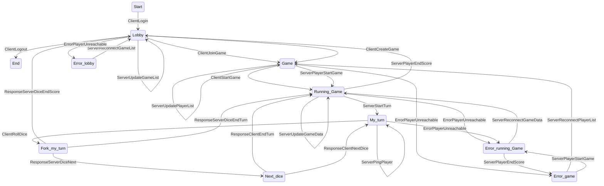
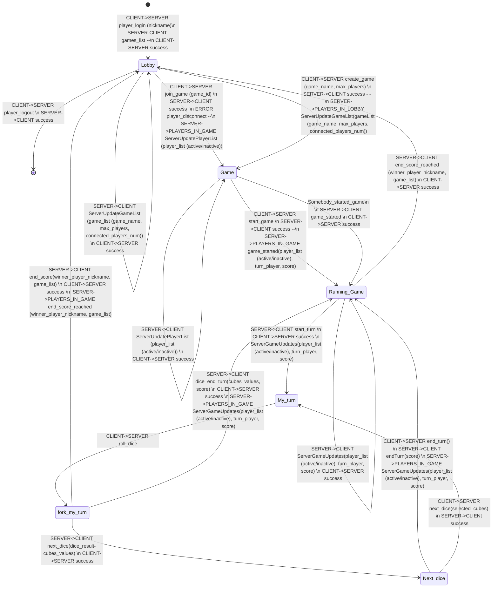

- Start
- Waiting for request
- Get request

## Control player table

- player list

  - player

    - player_id
    - game_id

## Requests

```json
{
  "header": {
    "signature": "KIVUPS",
    "command_id": 4,
    "player_id" : 5
  },
  "params": [
    {
      "key": "nickname",
      "value": "super_karel"
    }
  ]
}
```

### Message format

```json
KIVUPS;command_id;player_id;args...
```

- size_bytes: 1 bytes
- KIVUPS: 6 bytes
- command_id: 1 byte
- player_id: 2 bytes
- args: based on size_bytes

### Client-Server

#### **1 - Player connect**

- _Format:_
  - **{"nickname":"super_karel"}**

#### **21 - RESPONSE**

- one player
- _Format:_
  - **{"player_id":"3"}**

#### **2 - Create game**

- createGame()
- _Format:_

  - **ADD_GAME;{"name":"Room1","max_player_count":"5"}**
- ANSWER ALL - player joined to game

  - game id
  - player list

    - player_name
    - player_score

#### **30 SUCCESS - RESPONSE**

- one player

#### **3 - Join game**

- _Format:_
  - **JOIN_GAME;{"game_id":"7"}**
  -
- joinGame(game_id)
- ANSWER ALL - player joined to game

#### **23 RESPONSE**

- all players in game
- _Format:_
  - **["karel_1", "karel_2", "karel_3", "karel_4", "karel_5"]**
  -

#### **4 - Start game**

- - _Format:_
- **START_GAME;{}**
- Game.startGame()
- ANSWER ALL - game started
-

#### **5 - Player rolling dice**

- - - _Format:_
  - **ROLL_DICE;{}**
  - ANSWER ALL - game update

    - player_turn

      - score
      - current_dice

#### **7 - Player logging out**

- - _Format:_
- **LEAVE_GAME;{}**
- ANSWER ALL - player logged out

  - player_id
- player ending game

  - ANSWER ALL - player ended game

    - game_id
- Game

  - game state

    - in room
    - running
  - player list

    - player

      - current score
      - number of turns
  - game turn number
  -

#### **6 - End game**

- - _Format:_
- **LEAVE_GAME;{}**

#### **8 - Get game score**

- - _Format:_
- **LEAVE_GAME;{"game_id":"6"}**

  ### Server-Client
- **Rooms list - response: PLAYER_CONNECT**

  - game in room list
  - _Format:_
    - **ROOM_LIST;["game_id":{"name":"Room1","player_count":"5","state":"WAITING"}]}**

---

# Player Finite Automata





