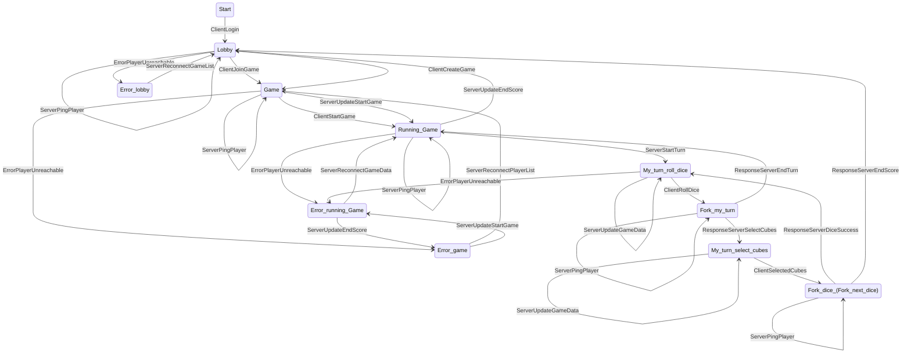
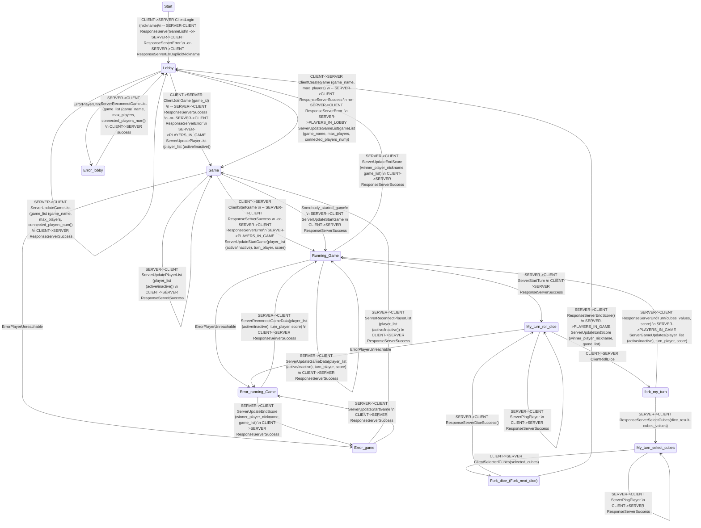

- Start
- Waiting for request
- Get request

## Message format

```plaintext
structure:
stamp;command_id;timestamp;{player_nickname};{args...}

example:
KIVUPS012024-12-31 15:30:00.000000{nickname}{}\n
```

### Param Format

**single params**

`{"gameName":"Game3", "maxPlayers":"3"}`

**array params**

`{"gameList":"[{"gameName":"Game1","maxPlayers":"4","connectedPlayers":"2"};{"gameName":"Game2","maxPlayers":"4","connectedPlayers":"2"}]"}`

#### Param arrays

**gameList**

- "gameName"
- "maxPlayers"
- "connectedPlayers"

**playerList**

- "playerName"
- "isConnected"

**gameData**

- "playerName"
- "isConnected"
- "score"
- "isTurn"

**cubeValues**

- "value"

### Sizes

- header
  - stamp:

    - 6 bytes
  - command_id:

    - 2 bytes
  - timestamp:

    - 26 bytes
    - format:

      - `%Y-%m-%d %H:%M:%S.%f`
      - `2025-01-04 12:47:56.816357`
    - player_nickname:

      - in between {}
  - args:

    - in between {}

# Commands

## Client-Server

#### **1 - Client login**

#### **21 - RESPONSE**

- one player
- _Format:_
  - **{"player_id":"3"}**

#### **2 - Create game**

- createGame()
- _Format:_

  - **ADD_GAME;{"name":"Room1","max_player_count":"5"}**
- ANSWER ALL - player joined to game

  - game id
  - player list

    - player_name
    - player_score

#### **30 SUCCESS - RESPONSE**

- one player

#### **3 - Join game**

- _Format:_
  - **JOIN_GAME;{"game_id":"7"}**
  -
- joinGame(game_id)
- ANSWER ALL - player joined to game

#### **23 RESPONSE**

- all players in game
- _Format:_
  - **["karel_1", "karel_2", "karel_3", "karel_4", "karel_5"]**
  -

#### **4 - Start game**

- - _Format:_
- **START_GAME;{}**
- Game.startGame()
- ANSWER ALL - game started
-

#### **5 - Player rolling dice**

- - - _Format:_
  - **ROLL_DICE;{}**
  - ANSWER ALL - game update

    - player_turn

      - score
      - current_dice

#### **7 - Player logging out**

- - _Format:_
- **LEAVE_GAME;{}**
- ANSWER ALL - player logged out

  - player_id
- player ending game

  - ANSWER ALL - player ended game

    - game_id
- Game

  - game state

    - in room
    - running
  - player list

    - player

      - current score
      - number of turns
  - game turn number
  -

#### **6 - End game**

- - _Format:_
- **LEAVE_GAME;{}**

#### **8 - Get game score**

- - _Format:_
- **LEAVE_GAME;{"game_id":"6"}**

  ### Server-Client
- **Rooms list - response: PLAYER_CONNECT**

  - game in room list
  - _Format:_
    - **ROOM_LIST;["game_id":{"name":"Room1","player_count":"5","state":"WAITING"}]
    - **

# Network messages - CURRENT

## CLIENT -> SERVER

- **ClientLogin**
  `CommandID: 1, Params: []` - nickname is in the header

  - **Response**
    - ResponseServerGameList
    - ResponseServerError
      - Error Duplicit nickname
      - Error other
- **ClientCreateGame**
  `CommandID: 2, Params: ["gameName", "maxPlayers"]`

  - **Response**
    - ResponseServerSuccess AND [To All]ServerUpdateGameList
    - ResponseServerError
- **ClientJoinGame**
  `CommandID: 3, Params: ["gameName"]`

  - **Response**
    - ResponseServerSuccess AND [To All]ServerUpdatePlayerList
    - ResponseServerError
- **ClientStartGame**
  `CommandID: 4, Params: []`

  - **Response**
    - ResponseServerSuccess AND [To All]ServerUpdateStartGame, ServerUpdateGameData
    - ResponseServerError
- **ClientRollDice**
  `CommandID: 5, Params: []`

  - **Response**
    - ResponseServerSelectCubes
    - ResponseServerEndTurn AND [To All]ServerUpdateGameData
    - ResponseServerError
- **ClientSelectedCubes(ClientNextDice)**
  `CommandID: 61, Params: ["cubeValues"] List`

  - **Response**
    - ResponseServerDiceSuccess
    - ResponseServerEndScore AND [To All]ServerUpdateEndScore]
    - ResponseServerError
- **ClientLogout**
  `CommandID: 7, Params: []`

  - **Response**
    - ResponseServerSuccess
    - ResponseServerError
- **ClientReconnect**
  `CommandID: 8, Params: []`

  - todo

---

## RESPONSES SERVER -> CLIENT

### GENERAL

- **ResponseServerSuccess**
  `CommandID: 30, Params: []`
- **ResponseServerError**
  `CommandID: 32, Params: ["message"]`

### SPECIFIC

- **ResponseServerGameList**
  `CommandID: 33, Params: ["gameList"] List`
-
- **ResponseServerSelectCubes (ResponseServerDiceNext)**
  `CommandID: 34, Params: ["cubeValues"] List`
- **ResponseServerEndTurn(ResponseServerDiceEndTurn)**
 `CommandID: 35, Params: []`
-
- **ResponseServerEndScore(ResponseServerNextDiceEndScore)**
  `CommandID: 36, Params: []`
- **ResponseServerDiceSuccess(ResponseServerNextDiceSuccess)**
  `CommandID: 37, Params: []`

---

## SERVER -> CLIENT

### SERVER -> ALL CLIENT

#### ONCE

- **ServerUpdateStartGame**
  `CommandID: 41, Params: []`
  - **Response**
    - ResponseClientSuccess
- **ServerUpdateEndScore**
  `CommandID: 42, Params: ["playerName"]`
  - **Response**
    - ResponseClientSuccess

#### CONTINOUS

- **ServerUpdateGameData**
  `CommandID: 43, Params: ["gameData"] List`
  - **Response**
    - ResponseClientSuccess
- **ServerUpdateGameList**
  `CommandID: 44, Params: ["gameList"] List`
  - **Response**
    - ResponseClientSuccess
- **ServerUpdatePlayerList**
  `CommandID: 45, Params: ["playersList"] List `
  - **Response**
    - ResponseClientSuccess

### SERVER -> ONE CLIENT

- **ServerReconnectGameList**
  `CommandID: 46, Params: ["gameList"] List`

  - **Response**
    - ResponseClientSuccess
- **ServerReconnectGameData**
  `CommandID: 47, Params: ["gameData"] List`

  - **Response**
    - ResponseClientSuccess
- **ServerReconnectPlayerList**
  `CommandID: 48, Params: ["playersList"] List `

  - **Response**
    - ResponseClientSuccess
- **ServerStartTurn**
  `CommandID: 49, Params: []`

  - **Simultaneously**
    - ServerUpdateGameData
  - **Response**
    - ResponseClientSuccess
- **ServerPingPlayer**
  `CommandID: 50, Params: []`

  - **Response**
    - ResponseClientSuccess

---

## RESPONSES CLIENT -> SERVER

- **ResponseClientSuccess**
  `CommandID: 60, Params: []`

---

## Errors

- **ErrorPlayerUnreachable**
  `CommandID: 70, Params: []`

---

# Player Finite Automata




